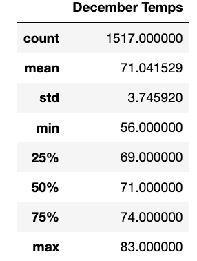
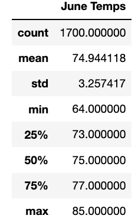
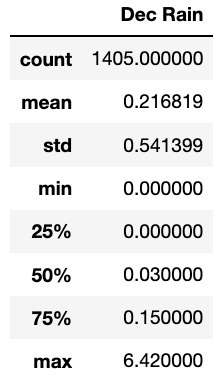
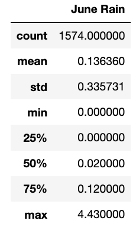
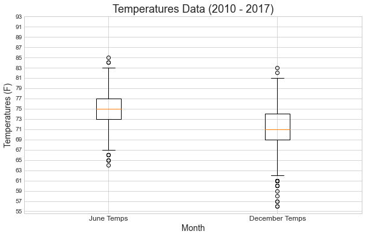
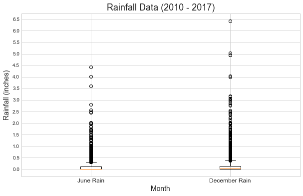

# Surfs Up

## Project Overview 
### Purpose
In order to launch a new *Surf’n’Shake* shop, that sells surf boards and ice cream in Oahu, Hawaii, the weather has to be favorable most days of a year in order to be able to run a profitable business. A perfect spot for the shop is a place with the right balance of climates throughout the year. If that criteria are met, we can be confident that new shop will be able to succeed in the long run. To ensure that the right spot is chosen, data-driven decisions have to be made; therefore, this analysis focuses on the temperature and then additional queiries were made to guage rainfall for the past 7 years (2010 to 2017), specifically for June and December. In order to have enough data, I am analyzing data from six weather stations in Oahu, Hawaii. The analysis consists of two parts:

- Temperature analysis for June and December from 2010 to 2017.
- Rainfall analysis for June and December from 2010 to 2017.

### Background
This shop can easily become a popular spot, potentially expanding to other Hawaiian Islands and other further-distance islands. Because of the potential quick turn-around, the analysis is built by using quick and fast tools:

•	**SQLite** a popular database engine, a version of SQL, that is stored locally and supports quick testing and easy prototyping. 

•	**SQLAlchemy** a query tool design for SQLite to query SQLite databases.

## Results 
The analysis focuses on the temperature and rainfall from six different weather stations on Oahu, Hawaii from 2010 to 2017 for June and December specifically. 

### Comparison of the Temperatures for June and December 

**1.	Number of data**
  - There are less data for December (1517 data points) than for June (1700 data points).

**2.	Dispersion of the data**
  -	Temperatures are more spread out in December (std = 3.7) than in June (std = 3.3).
  -	June’s mean and median are 74.94 °F and 75.00 °F respectively.
  -	December’s mean and median are 71.04 °F and 71.0 °F respectively.
  -	Maximum temperature in December is 83 °F and in June 85 °F.
  -	Minimum temperature in December is 56 °F and in June 64 °F.

**3.	Quartiles**
  -	1st quartile: 25% of all data is below 69 °F in December and 73 °F in June.
  -	3rd quartile 75% of all data is below 74 °F in December and 77 °F in June.

 

Measures of Central Tendency of Temperatures for December and June in Oahu, Hawaii. 

### Comparison of the Rainfall for June and December

**1.	Number of data**
  - There are less data for December (1405 data points) than for June (1574 data points).

**2.	Dispersion of the data**
  -	Rainfall quantity is more spread out in December (std = 0.5) than in June (std = 0.33).
  -	June’s mean and median are 0.13 inches and 0.02 inches respectively.
  -	December’s mean and median are 0.21 inches and 0.03 inches respectively.
  -	Maximum rainfall in December is 6.42 inches and 4.43 inches in June.
  -	Minimum rainfall in December is 0 inches and 0 inches in June.

**3.	Quartiles**
  -	1st quartile: 25% of all data is at 0 inches in December and 0 inches in June.
  -	3rd quartile 75% of all data is below 0.15 inches in December and 0.12 inches in June.

 

Measures of Central Tendency of Rainfall for December and June in Oahu, Hawaii. 

## Summary 
Descriptive statistics from the queries above provide quick results and tells us a lot about the weather in that area. However, to fully understand the weather trend, I have provided additional analysis and explanation.

### Temperatures for June and December 

From the temperature report we can see that there is not much difference in the weather in June and December, indicating a steady temperature year-round. Mean and median are close together, meaning that distribution of the data is not spread out. To find out protentional outliers and other trends **the box and whiskers chart** can tell us more about that.

 

Box and Whiskers Plot of Temperatures for December and June in Oahu, Hawaii. 

From the graph we can see that there are just a few outliers. There are more outliers below the lower boundary in December, however the minimum temperature is approximately 55 °F. 

### Rainfall for June and December

The first difference that we notice is the max rainfall in June and December (4.43 and 6.42 inches respectively) and in both cases, highly above the mean. Also, standard deviation is high, mean and median or 2nd quartile are far apart, meaning that distribution of the data is highly spread out. That indicates the presence of extreme values in the dataset. The easiest way to determine outliers is to plot **box and whiskers chart**.

 

Box and Whiskers Plot of Rainfall for December and June in Oahu, Hawaii. 

From the chart we can see that there are quite a few outliers. Those outliers have enough power to impact the mean, yet the nuber of data points found as outliers as compared to the total number of data points (1574 and 1405 respectively) is not that much. This indicates isolated extreme rainfall. 
This analysis capture weather data for 7 years from 2010 to 2017. 

